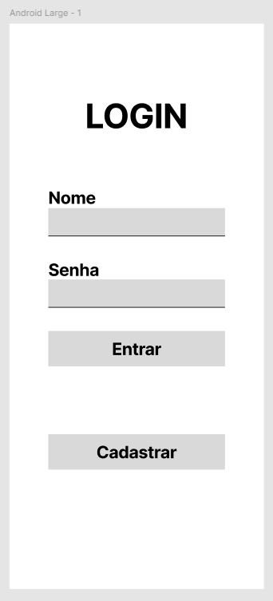

# Sistema de login

---

## Objetivo
Esta aplicação é um estudo para praticar e desenvolver um sistema de login funcional

## Funcionalidades
Neste sistema o usuario será capaz de logar ou se cadastrar na aplicação, utilizando um nome de usuario e uma senha

## Tecnológias
 - **Back-end**: Node.js
 - **Front-end**: HTML/CSS e Javascript/vanilla
 - **Banco de dados**: PostgreSQL

## Segurança
**Senhas**
Como forma de segurança as senhas seram armazenadas em forma de hash, para evitar a descoberta da mesma.

**Autenticação**
No front-end sera utilizado o JWT (JSON Web Token), para autenticação do usuário

---
## Configurações

### Ambiente de desenvolvimento, *Deploy* e homologação
**Ambiente de desenvolvimento**
 - **Visual studio code**: Editor de codigo, comummente utilizado para criação de aplicações web
 - **Node.js**: Será o *runtime* utilizado para o desenvolvimento da aplicação *Server-side*
 - **PostgreSQL/PgAdmin**: SGDB para gestão da base de dados de usuários

**Ambiente de homologação e testes**
 - **Docker**: Serviço de virtualização de sistema, para criação de conteiners de serviços e aplicações, servindo tambem para homologação

**Ambiente de deploy**
 - **Railway**: IaaS(Infrastructure as a Service), plataforma que irá provissionar o banco de dados Postgres e executará a API
 - **Netlify**: PaaS(Platform as a Service), plataforma que irá hospedar a aplicação client-side

---

## Utilização

---

## Tecnologias Utilizadas

### Front-end / Client-side

Para a criação da aplicação client-side será utilizado **HTML/CSS** para o desenvolvimento da interface, utilizando componentes simples como *form*, com boas praticas de semântica. Em futuras implementeções há a possibilidade da utilização de bibliotecas como ***React*** ou *frameworks* como ***Vue*** e ***Angular***.

Para a hospedagem da página será utlizado a plataforma Netlify, por conta de ser simples e possuir um plano gratuito

#### Interface - Prototipo inicial 

Para o prototipo inicial, seguirá o conceito de *mobile-first*, tendo inicialmente a função de login e em seguida a função de cadastro
{width=250}

#### Botões
**Entrar**: Ao clicar em entrar sera enviado uma requisição para o back-end com as informações para login

**Cadastrar**: Ao clicar em cadastrar será pedido as informações de nome de usuário e senha

### Back-end/Server-side ou API

A ***API (Application Program Interface)***, será desenvolvida utlizando ***node.js***, fará o uso das seguintes bibliotecas:
 - ***Express.js***
 - ***JWT (JSON web token)***
 - ***node-postgres***

